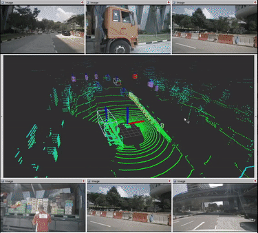
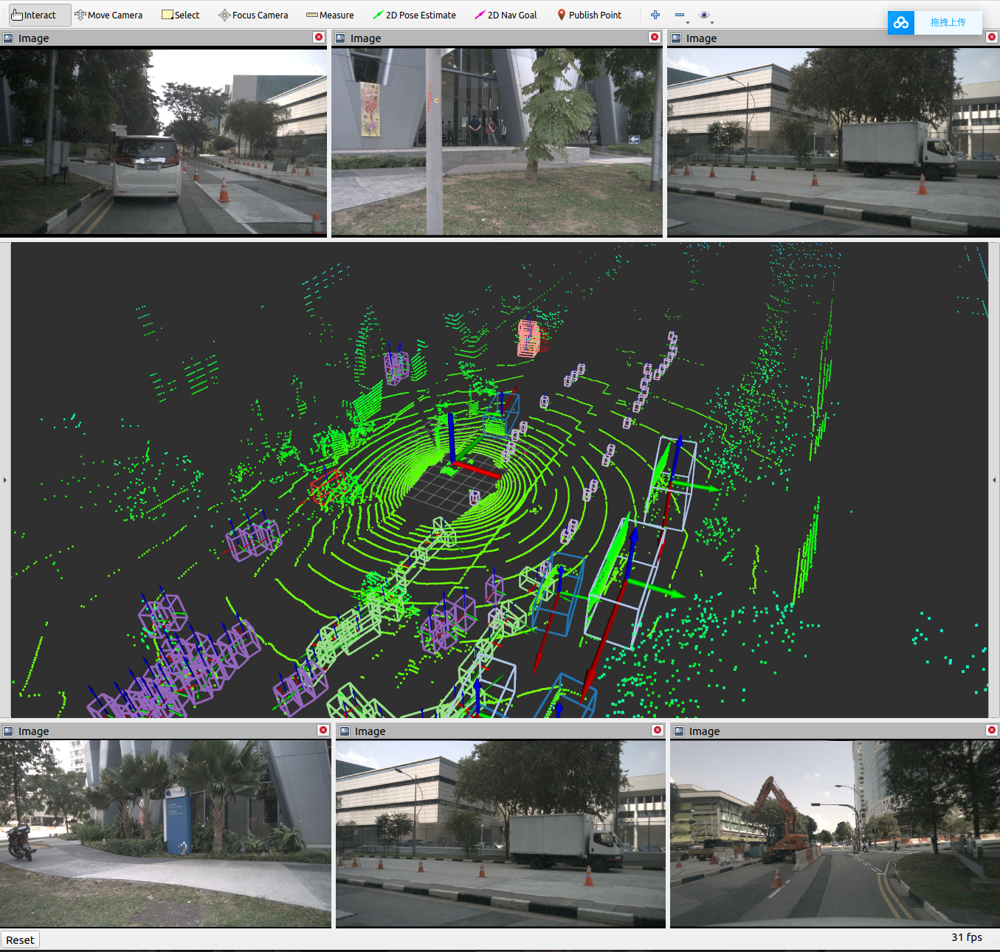

# BEVDet by TensorRT, C++, ROS

  

+ This repository contains source code and models for BEVDet online real-time inference using CUDA, TensorRT, ROS1 & C++.

+ Modify the record reference [modify](https://github.com/linClubs/BEVDet-ROS-TensorRT/tree/main/doc/modify.md)

# 1 ENV

- **ubuntu-20.04、CUDA-11.3、cuDNN-8.6.0、TensorRT-8.5**
- **yaml-cpp、Eigen3、libjpeg**

# 2 Build

~~~python
mkdir -p bev_ws/src
cd bev_ws/src
git clone https://github.com/linClubs/BEVDet-ROS-TensorRT.git
cd ..
catkin_make
source devel/setup.bash
~~~

# 3 Run

1. generate engine

Generate the onnx TensorRT engine reference to [bevdet-tensorrt-cpp](https://github.com/LCH1238/bevdet-tensorrt-cpp)  engine path as follows.

~~~python
# engine path
BEVDet-ROS-TensorRT
    └──ckpts
        ├── bev_stage_lt_d.engine
        ├── img_stage_lt_d.engine
        └── lt_d.yaml
~~~

2. data preparation
The rosbag folder can be downloaded from [Baidu Netdisk](https://pan.baidu.com/s/1f3nUnHa_4cd6FsRTV8YhkA?pwd=rjim)

3. demo test
~~~python

# 1. start bevdet_node
roslaunch bevdet bevdet_node.launch

# 2  play data
rosbag play nus.bag
~~~

  

---

# References
- [bevdet-tensorrt-cpp](https://github.com/LCH1238/bevdet-tensorrt-cpp)
- [BEVDet](https://github.com/HuangJunJie2017/BEVDet)
- [mmdetection3d](https://github.com/open-mmlab/mmdetection3d)
- [nuScenes](https://www.nuscenes.org/)

- bev感知交流群-472648720, 欢迎各位小伙伴进群一起学习讨论bev相关知识！！！^_^

  

---